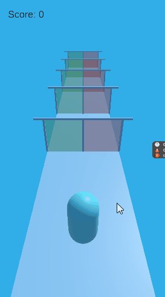

# unity-morpeh-hypercasual

A Simple project for Morpeh ECS Framework Learning.

### Project Specification
Unity Version: 2021.3.21.f1

Platform: Windows & Android

### Project Preview

### Manuals
#### Systems
1. `PlayerMovementSystem`
Move Player Forward & Horizontally based on Input

2. `FloorMovingSystem`
Move Player based on Player Forward Speed

3. `GoalPostSpawnerSystem`
Spawn Goals & Relocate them on triggered

4. `PlayerCollideSystem`
Track & Check for trigger between goals & player

5. `PlayerInputApplierSystem`
Apply Input to player movement

6. `PlayerInputCollectorSystem`
Poll & Store Input from Unity
